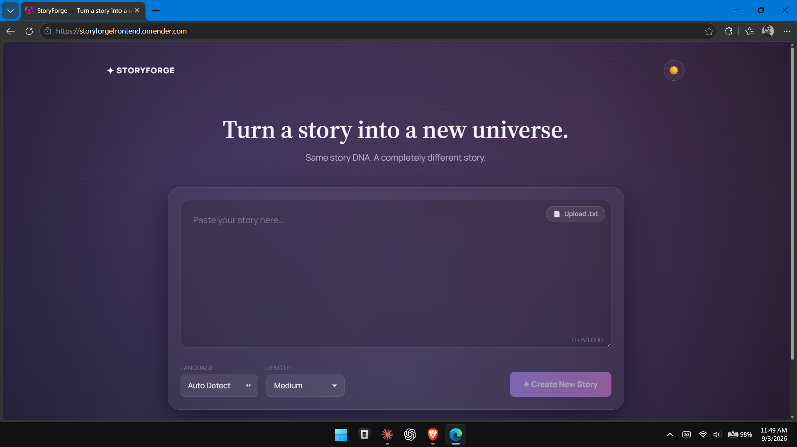
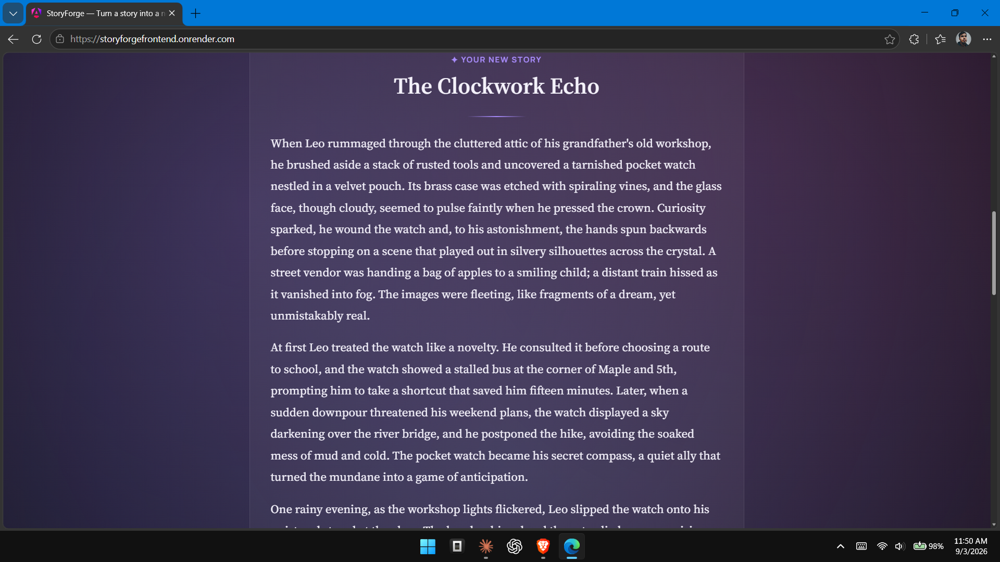
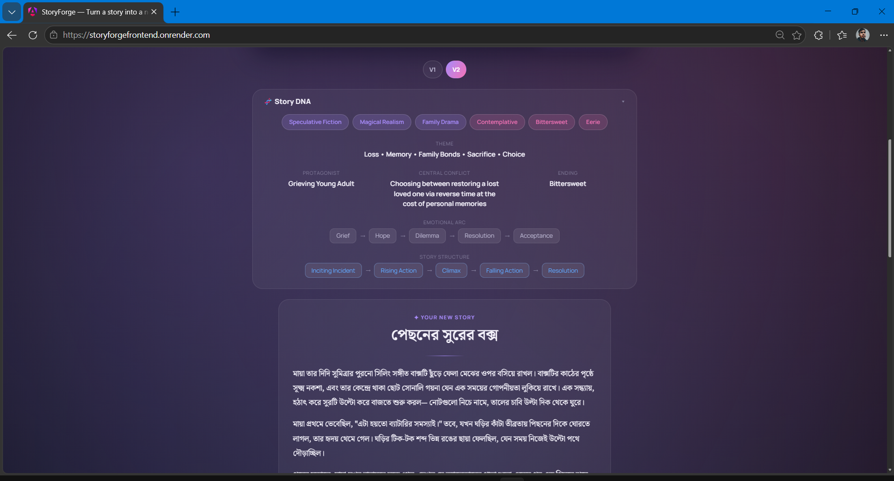

# StoryForge

[](https://storyforgefrontend.onrender.com/)

StoryForge analyzes a story's narrative DNA (genre, themes, tone, archetypes, conflict,
emotional arc, structure, ending) and generates a new, independently written story
inspired by that DNA — not a rewrite, paraphrase, or translation.

```
Angular  ->  ASP.NET Core (.NET 10)  ->  Groq API
```

No database, no authentication, no server-side story storage. See `StoryForge_PRD.md`
for the full product spec this implementation follows.

## Why this exists

Most "AI story tools" either paraphrase your input or write something generic and
unrelated. StoryForge does neither — it extracts the *shape* of a story (genre, tone,
character archetypes, conflict, emotional arc, structure, ending) and hands that DNA to
the model as the creative brief, discarding the original wording entirely. The result is
a new story that feels related to the source without being a disguised copy of it — a
way to explore "what if this same emotional arc played out differently."

## When to use it

- You have an idea or an old story and want to see it reimagined with new characters,
  settings, and events, but the same narrative core.
- You want quick creative variations of a plot to pick the direction you like best.
- You want to iterate on a generated story with plain-language feedback
  ("make the ending darker", "make the protagonist morally grey") instead of rewriting
  it by hand.
- You write in Bangla or English and want the output in either language, independent of
  the input language.

## Screenshots

| Home | English story | Bangla story |
|---|---|---|
|  |  |  |

## Project layout

```
StoryForge.Api/     ASP.NET Core 10 minimal API backend
storyforge-web/      Angular 21 standalone frontend
start.bat / stop.bat Windows scripts to run/stop both servers
```

## Prerequisites

- .NET 10 SDK
- Node.js 20+ and npm
- A Groq API key (https://console.groq.com)

## Quick start (Windows)

```bash
start.bat
```

This starts the backend (`http://localhost:5276`) and frontend (`http://localhost:4200`)
in separate console windows and opens the app in your browser. Run `stop.bat` to stop
both — it only terminates whatever is listening on ports 5276 and 4200, nothing else.

## Configuring the Groq API key (required)

The key must **never** be committed to source control or placed in any file under
`storyforge-web/` (anything there ships to the browser). Set it on the backend only.

**Development** — use .NET user-secrets (already initialized for this project):

```bash
cd StoryForge.Api
dotnet user-secrets set "Groq:ApiKey" "your-groq-api-key"
```

**Production** — set an environment variable instead (Kestrel/ASP.NET Core reads
double-underscore-separated env vars into the same configuration section):

```bash
# Linux / macOS
export Groq__ApiKey="your-groq-api-key"

# Windows (PowerShell)
$env:Groq__ApiKey = "your-groq-api-key"
```

## Running manually (without the .bat scripts)

Backend:

```bash
cd StoryForge.Api
dotnet run --urls http://localhost:5276
```

Frontend (in a second terminal):

```bash
cd storyforge-web
npm install
npm start
```

The Angular dev server proxies `/api/*` to `http://localhost:5276` (see
`storyforge-web/proxy.conf.json`), so no CORS configuration is needed for local
development. Open `http://localhost:4200`.

## Configuration reference

All of the following live in `StoryForge.Api/appsettings.json` (safe defaults, no
secrets) and can be overridden per-environment via `appsettings.Development.json`,
`appsettings.Production.json`, or environment variables.

| Section | Key | Default | Purpose |
|---|---|---|---|
| `Groq` | `ApiKey` | *(secret — set via user-secrets/env var)* | Groq API key |
| `Groq` | `Model` | `openai/gpt-oss-120b` | Groq model id |
| `Groq` | `BaseUrl` | `https://api.groq.com/openai/v1/` | Groq API base URL |
| `Groq` | `TimeoutSeconds` | `60` | HTTP timeout for Groq calls |
| `Story` | `MinCharacters` | `100` | Minimum source story length |
| `Story` | `MaxCharacters` | `60000` | Maximum source story length |
| `Story` | `MaxFeedbackCharacters` | `5000` | Maximum feedback text length |
| `RateLimit` | `PermitLimit` / `WindowSeconds` | `10` / `60` | Per-IP sliding-window limit on `/api/story/generate` |
| `Cors` | `AllowedOrigins` | *(empty in base; set per environment)* | Allowed browser origins |

`Groq:Model` can be changed to any chat-completion model available on your Groq
account that supports `json_mode` (check `GET /v1/models` on the Groq API). Run
`dotnet build` after any config change is picked up automatically at next `dotnet run`
— no code changes needed.

## Building for production

Backend:

```bash
cd StoryForge.Api
dotnet publish -c Release -o publish
```

Deploy the `publish/` output behind HTTPS, set `Groq__ApiKey` and `Cors__AllowedOrigins__0`
(your deployed frontend origin) as environment variables, and set
`ASPNETCORE_ENVIRONMENT=Production`.

Frontend:

```bash
cd storyforge-web
npm run build
```

Deploy the contents of `storyforge-web/dist/storyforge-web/browser` to any static host
(the app talks to the backend via absolute path `/api/...`; if the frontend and backend
are not served from the same origin in production, either put them behind the same
reverse proxy path, or add an origin-aware API base URL and configure CORS accordingly).

Recommended security headers at your static host / reverse proxy level (the backend
already sets its own on API responses):

```
Content-Security-Policy: default-src 'self'; style-src 'self' 'unsafe-inline' fonts.googleapis.com; font-src fonts.gstatic.com; connect-src 'self'
X-Content-Type-Options: nosniff
Referrer-Policy: no-referrer
Permissions-Policy: geolocation=(), microphone=(), camera=()
```

Test this CSP against the actual built app before relying on it — adjust `style-src`/
`font-src` if you change the Google Fonts used in `storyforge-web/src/styles.css`.

## Security notes

- The Groq API key lives only in backend configuration (user-secrets in dev, env vars
  in prod) — it is never sent to the browser or logged.
- Source stories, generated stories, and feedback text are never logged or persisted
  server-side; the backend processes each request statelessly.
- `/api/story/generate` is rate-limited per IP (10 requests/60s by default) and request
  bodies are capped (1 MB) to reduce abuse.
- AI output is validated (required fields, length/size bounds) before being returned;
  malformed model output is rejected with a generic error rather than passed through.
- The generated story is rendered as plain text in Angular (never `innerHTML`), so
  model output cannot inject markup into the page.

## Mature content

The system prompt allows dark/mature storytelling (see `StoryForge.Api/Prompts/StoryPrompts.cs`)
but explicitly forbids sexual content involving minors under any framing, and does not
attempt to bypass the underlying model's own safety policies. What the model actually
produces is still bounded by Groq/`openai/gpt-oss-120b`'s own content policies.
